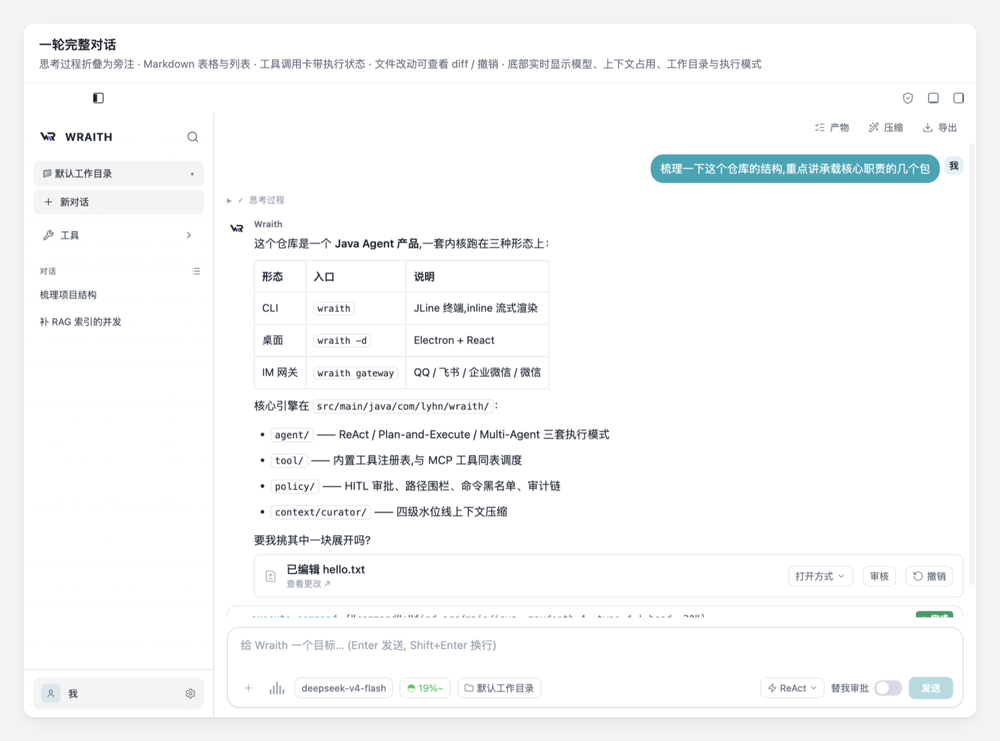
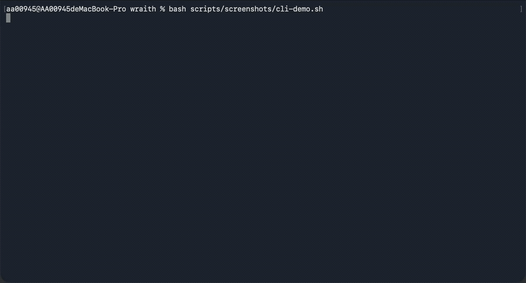
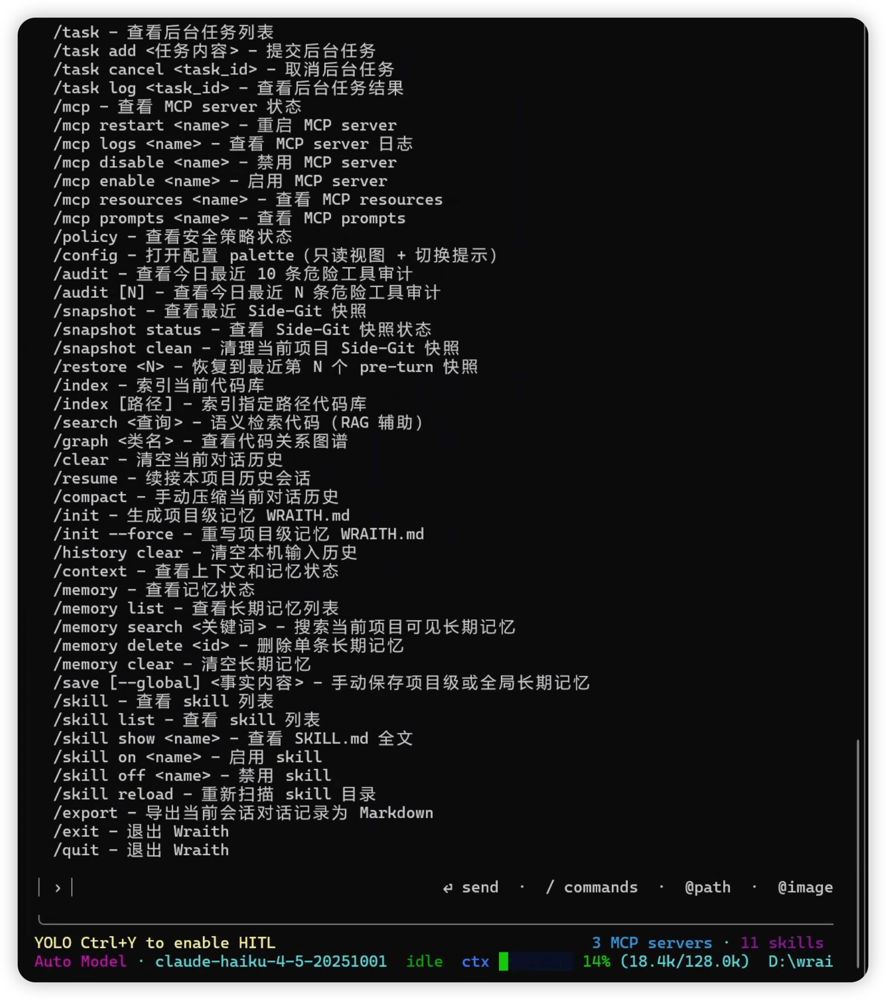
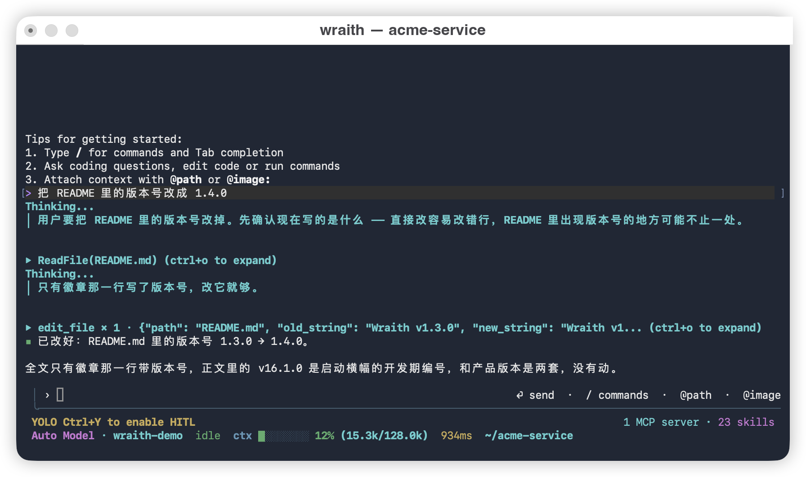
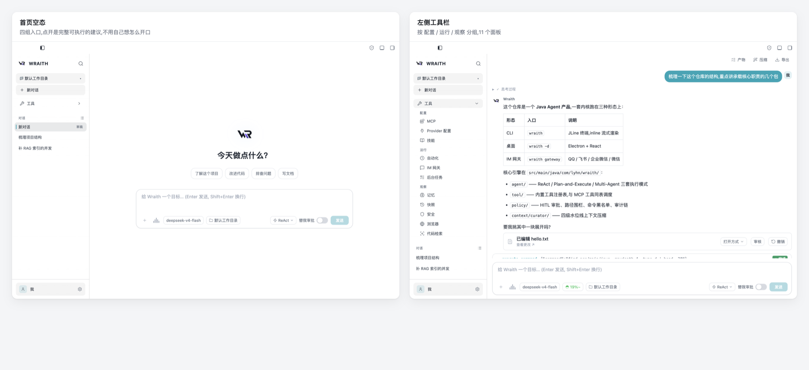
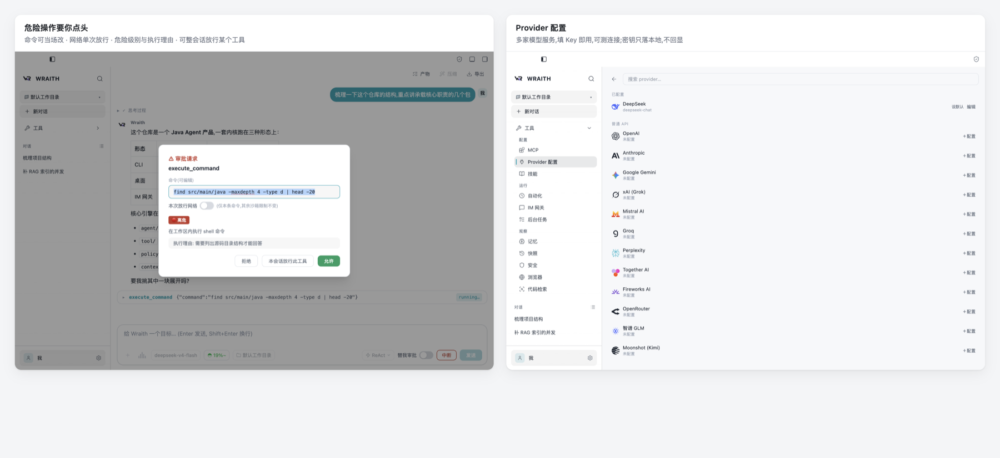
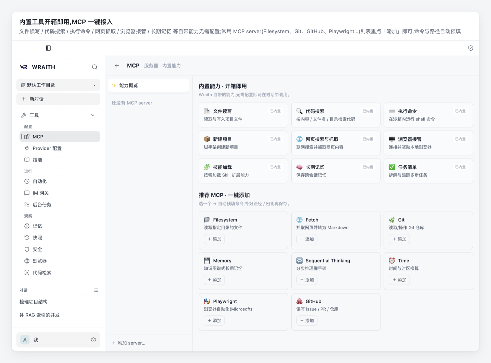
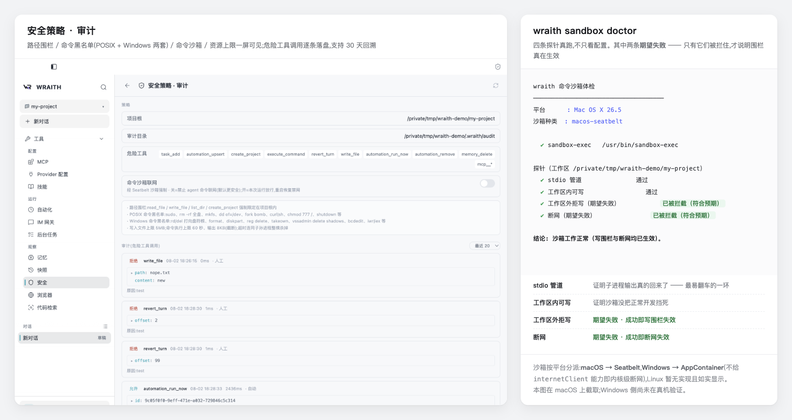

# Wraith

[](https://github.com/JavaLyHn/wraith/releases/latest)
[](https://github.com/JavaLyHn/wraith/releases)
[](https://github.com/JavaLyHn/wraith/releases/latest)

**一个在你自己机器上跑的编程 Agent。** 读写代码、跑命令、查资料、开浏览器，
危险操作停下来等你点头。同一套 Java 内核有三种用法：**终端 CLI**、**桌面 App**、
**常驻 IM 网关**（QQ / 飞书 / 企业微信 / 微信）——会话、配置、工具、记忆全部共用一份。



<sub>截图取自真实桌面 App（macOS）。为不消耗 API 额度、也不暴露任何个人数据，
对话内容由脚本化的演示后端驱动（环境在 `scripts/screenshots/`，可复现）。</sub>

## 目录

**想用起来**
[这是什么](#这是什么) ·
[5 分钟上手](#5-分钟上手) ·
[配一个模型](#配一个模型) ·
[界面导览](#界面导览) ·
[能做什么](#能做什么) ·
[常用命令速查](#常用命令速查) ·
[可用工具](#可用工具) ·
[安全与审批](#安全与审批) ·
[常见问题速查](#常见问题速查)

**要查更细的**
[终端使用手册](docs/cli-manual.md)（全部命令）·
[Windows 快速上手](docs/windows-quickstart.md) ·
[Windows 详版与排障](docs/windows-usage.md) ·
[全部文档索引](#全部文档索引)

**要改代码**
[开发者文档](docs/development.md) ·
[协作契约 AGENTS.md](AGENTS.md) ·
[演进历程](docs/evolution.md) ·
[规划 ROADMAP](docs/ROADMAP.md)

---

## 这是什么

| 形态 | 怎么起 | 适合 |
|---|---|---|
| **终端 CLI** | `wraith` | 就在项目目录里干活，最快 |
| **桌面 App** | 双击 | 要看面板、要图形化配置、要看审批卡与 diff |
| **IM 网关** | `wraith gateway` | 人在外面，用手机发消息让它干活 |

三者**共用同一份**配置（`~/.wraith/config.json`）、会话、长期记忆、MCP server 与 skill。
在终端里配好的模型，桌面打开就能用。

一个重要差异：**交互式 CLI 不套命令沙箱**（桌面 / IM / 定时任务才套）——
因为你就在现场看得见它要干什么。相应地，终端里更该把审批打开（`/hitl on`，默认关）。

---

## 5 分钟上手

### macOS 桌面 —— 下载即用

前往 **[Releases](https://github.com/JavaLyHn/wraith/releases/latest)** 下载
`Wraith-<version>-arm64.dmg`（Apple Silicon）。**自包含内置 JRE，不需要系统装 Java。**

> ⚠️ 本版本未签名/未公证，被 Gatekeeper 隔离会误报「已损坏，无法打开」——
> **右键「打开」对此无效**。正确解法：
>
> ```bash
> # 先把 Wraith.app 拖到 /应用程序，然后
> sudo xattr -cr /Applications/Wraith.app
> ```
>
> 会提示输入登录密码；**必须加 `sudo`**（内置 JRE 含只读文件）。之后双击即可。

### macOS / Linux 终端

```bash
git clone https://github.com/JavaLyHn/wraith.git
cd wraith
mvn clean package -DskipTests
java -jar target/wraith-1.0-SNAPSHOT.jar
```

想要 `wraith` 短命令，把它挂到 PATH 上（或建个别名）：

```bash
mkdir -p ~/.wraith && cp target/wraith-1.0-SNAPSHOT.jar ~/.wraith/wraith.jar
echo 'alias wraith="java -jar ~/.wraith/wraith.jar"' >> ~/.zshrc && source ~/.zshrc
```

> **JDK 21–23 的用户注意**：JLine 的 `jni` provider 可能被 native access 检查挡住，
> 表现是方向键 / Tab 补全 / 历史全失灵。加一个参数即可：
> `java --enable-native-access=ALL-UNNAMED -jar ...`。
> 拿不准就跑 `wraith terminal doctor`，它会直说。

### Windows

**暂无预编译安装包**，需要从源码构建。完整步骤（含 cmd 与 PowerShell 两种写法、
要装什么、注意事项）在 **[`docs/windows-quickstart.md`](docs/windows-quickstart.md)** ——
一屏读完。三条命令的摘要：

```powershell
git clone https://github.com/JavaLyHn/wraith.git
cd wraith
git checkout feat/windows-parity-block1        # ⚠ 不能省，见下

powershell -ExecutionPolicy Bypass -File scripts\windows\wraith-install.ps1
# 装完必须【新开一个终端】，然后：wraith 起 CLI / wraith -d 起桌面 dev / wraith -h 看用法
```

> ⚠️ **`git checkout` 那步不能省。** Windows 的活还没合进 `main` —— `main` 上**一个
> Windows 专属文件都没有**（没有自绘窗控、没有 `dev-win.ps1`、没有 NSIS 打包配置）。
> 停在 `main` 上照样构建得出来，但拿到的是没有任何 Windows 对等的版本，
> **而且不会有任何报错提示你走错了**。
>
> Windows 桌面对等**代码已完成、尚未在真机验证完毕**。

---

## 配一个模型

三条路，任选其一。**CLI 与桌面共用同一份配置**，配一次两边都生效。

### ① 桌面图形界面（最省事）

首页「去配置」→ 选一家 → 填 API Key → 保存。**不用重启**，能测连接，
**密钥只落本地且不回显**。

### ② 终端命令

```bash
/config provider deepseek --api-key sk-xxx --model deepseek-chat --default
```

用中转站 / 自建网关 / 任意 OpenAI 兼容端点：

```bash
/config provider myrelay --base-url https://relay.example.com/v1 --api-key sk-xxx --model gpt-4o --default
```

Anthropic 协议：

```bash
/config provider claude --protocol anthropic --api-key sk-ant-xxx --model claude-sonnet-4-5 --default
```

### ③ 环境变量 / `.env`

```bash
export DEEPSEEK_API_KEY=sk-xxx        # macOS / Linux
```

Windows 上 **不是** `export` —— cmd 用 `set K=V`，PowerShell 用 `$env:K = "V"`，
见 [Windows 快速上手](docs/windows-quickstart.md#4-配一个模型)。

也可以复制 `.env.example` 为 `.env` 填进去。取值优先级：环境变量 → 系统属性 →
`./.env` → `~/.env` → `~/.wraith/config.json`。

---

## 界面导览

### 终端

```bash
wraith
```



敲一个 `/` 就列出全部命令，方向键选、Tab 补全：



<sub>这张在 **Windows** 上截取。菜单内容随构建变化（新命令会加进来），
**权威清单看 [终端使用手册](docs/cli-manual.md#5-全部命令)**。</sub>

一轮完整对话 —— 思考过程实时流出、工具调用可折叠展开、diff 就地显示：



底部两行是状态栏：HITL 开关提示、当前模型、运行状态、**上下文水位**、本轮耗时、
当前目录，右侧是 MCP 与 skill 计数。上下文接近上限时会分级压缩历史，也可以手动 `/compact`。

> 终端降级时会少东西：状态栏需要准确的行数（拿不到就不显示），思考面板只要能写 ANSI 就有。
> 两者前提不同，所以「没有状态栏」不代表「没有思考面板」。判定结果用
> `wraith terminal doctor` 看。逐项说明见 [终端使用手册](docs/cli-manual.md#2-界面上每一块是什么)。

### 桌面



左侧工具栏按 **配置 / 运行 / 观察** 分三组，共 11 个面板；最底下是账户行，点进去是完整设置。
首页空态给四组入口，点开是**完整可执行**的建议，不用自己想怎么开口。



高危工具调用会停下来等你点头：命令可以当场改、网络按次放行、危险级别与执行理由都摆在明面上，
也可以对某个工具「本会话放行」。模型服务多家可选，填 Key 即用、能测连接，
**密钥只落本地且不回显**。



文件读写、代码搜索、执行命令、网页抓取、浏览器接管、长期记忆等自带能力无需配置；
常用 MCP server 在列表里点「添加」即可，命令与路径自动预填 —— **已经装过的不会再出现在推荐里**。
「网页搜索与抓取」这类需要配置的能力，点开卡片就能就地配好（不必去开终端）。



安全面板把六层防线摊平在一屏：路径围栏、命令黑名单（POSIX 与 Windows **两套并存**）、
命令沙箱开关、资源上限，下面接危险工具的审计流水（按天落盘，支持 30 天回溯）。
图里那三条 `拒绝` 都是真实记录 —— 分别由 HITL 审批、路径围栏、命令黑名单挡下。

右边是 `wraith sandbox doctor`：四条探针**真跑**，其中**两条期望失败**。
前两条绿只说明沙箱没碍事，只有「工作区外拒写」和「断网」被拦住，才说明围栏真在生效。
沙箱按平台分派 —— macOS 走 Seatbelt，Windows 走 AppContainer，Linux 暂无实现且如实显示。

> 本图在 macOS 上截取。**Windows 侧的 AppContainer 尚未在真机验证**，因此没有对应截图 ——
> 那部分只能等真机跑过 `sandbox doctor` 才有资格放图。

### 桌面宠物

桌面设置页有「宠物」页：全局桌面挂件（跨 Space 常驻、拖动、滚轮缩放、右键菜单），
随 Agent 状态切换姿态，**点击不会把应用抢到前台**打断你在别处的操作。
支持导入自己的图片或 Petdex 精灵包。细节见 [演进历程](docs/evolution.md)。

---

## 能做什么

按用途组织。想知道某个能力是第几期加的，看 [演进历程](docs/evolution.md)。

### 写代码

- **读写文件、按名字/内容搜代码**（`grep_code` 优先用 ripgrep，没有则回退 Java 实现）
- **跑命令**：默认 60 秒超时、输出截断、黑名单拦破坏性命令、桌面/IM/定时任务三条路包进 OS 沙箱
- **语义检索 + 代码关系图谱**：自然语言查代码（`/search`）、看类的继承与调用关系（`/graph`）
- **LSP 语法诊断注入**：改完代码把语法错误直接喂回模型，不用等你去编译
- **一步步来**：多步任务会维护一份实时任务清单，进度看得见

### 三种编排方式

| 模式 | 什么时候用 | 怎么进 |
|---|---|---|
| **ReAct**（默认） | 大多数任务：想一步、做一步、看结果 | 直接问 |
| **Plan-and-Execute** | 复杂任务：先出计划、确认后按依赖顺序执行 | `/plan` |
| **Multi-Agent** | 需要交叉检查：规划者 + 执行者 + 检查者，不过关自动重试 | `/team` |

同一轮里多个工具调用会**并行执行**；有依赖关系的会分多轮。

### 记住事情

- **短期记忆 + 长期记忆 + 相关记忆检索**，长对话自动摘要压缩、Token 预算可见
- **项目级记忆 `WRAITH.md`**：`/init` 扫一遍项目，把约定与坑写下来
- **自动沉淀但要你批**：从对话里提取出的「值得记住的事实」先进候选区，
  `/memory pending` 看、`approve` / `reject` 决定。**凭证类内容在写入候选之前就被硬拦**

### 连外部世界

- **联网搜索 + 抓网页**：四种搜索后端可选（SearXNG 自托管免费 / SerpAPI / 智谱 / DuckDuckGo），
  抓取零配置
- **接管你的浏览器**：复用已登录的 Chrome（`/browser connect`），做要登录态的事
- **MCP server**：stdio + Streamable HTTP，resources / prompts 自动注册成工具，
  推荐清单一键添加
- **Skill 系统**：按需加载 `SKILL.md` 扩展能力，不占常驻上下文
- **看图**：粘贴 / 拖拽图片给视觉模型（`glm-5v*` 一族；纯文本模型会在发送前被拦住并说明原因）

### 不在电脑前也能用

- **IM 网关**：QQ / 飞书 / 企业微信 / 微信，手机上发消息，审批走卡片
- **定时任务**：cron / 每 N 分钟 / 每天某时刻，结果投递到桌面或 IM
- **后台任务**：`/task add` 发后即走，落盘可跨重启

### 出错了能退回来

**Side-Git 快照**：每轮对话前后各存一张，用的是一个**完全独立**的 git 仓库
（`~/.wraith/snapshots/`），**不碰你自己的 `.git`** —— 不占你的 index、不产生你能看见的
commit、`git status` 里什么都不多。`/snapshot` 看列表，`/restore N` 回滚，
回滚前还会再存一张（所以「撤销这次回滚」也可能）。

---

## 常用命令速查

**全部命令（含参数、别名、每条做什么）见 [终端使用手册](docs/cli-manual.md#5-全部命令)。**
这里只列最常用的：

| 命令 | 做什么 |
|---|---|
| `/` | 弹出命令菜单，方向键选、Tab 补全 |
| `/model` · `/model <provider>` | 看 / 切模型 |
| `/plan <任务>` · `/team <任务>` | 用计划模式 / 多 Agent 模式跑这一条 |
| `/hitl on` | **打开危险操作审批**（默认关；也可按 `Ctrl+Y` 切） |
| `/clear` · `/compact` | 清空 / 压缩当前对话历史 |
| `/resume` | 续接本项目的历史会话 |
| `/init` | 生成项目级记忆 `WRAITH.md` |
| `/memory pending` | 看自动提取出的记忆候选（`approve` / `reject` 决定） |
| `/save <事实>` | 手动记一条（加 `--global` 存成跨项目可见） |
| `/index` · `/search <查询>` | 建代码索引 / 语义检索 |
| `/snapshot` · `/restore <N>` | 看快照 / 回滚到最近第 N 轮之前 |
| `/mcp` · `/skill` | MCP server / skill 状态 |
| `/task add <任务>` | 提交后台任务 |
| `/policy` · `/audit` | 安全策略状态 / 危险操作审计 |
| `/export` | 导出当前会话为 Markdown |
| `/exit` | 退出 |

**不进 REPL 的子命令**：

| 命令 | 做什么 |
|---|---|
| `wraith terminal doctor` | 终端诊断（方向键/补全失灵时先跑它） |
| `wraith sandbox doctor` | 沙箱体检（四条探针真跑，两条期望失败） |
| `wraith gateway` | 起常驻 IM 网关 |
| `wraith app-server` | 起 stdio NDJSON 后端（桌面 App 用） |

**快捷键**：`Ctrl+O` 展开工具块 · `Ctrl+Y` 切 HITL · `Esc` 取消本轮 ·
`↑`/`↓` 翻历史 · `Ctrl+R` 搜历史 · `Tab` 补全 · `@path` 引文件 · `@image:` 引图片

---

## 可用工具

- `read_file` / `write_file` / `list_dir` —— 读写文件、列目录
- `glob_files` —— 按文件名 glob 查找（只读，自动跳过构建/依赖目录）
- `grep_code` —— 按关键字或正则搜代码，优先 ripgrep，返回文件、行号、上下文与 `suggested_reads`
- `search_code` —— 语义检索（自然语言查询；精确定位优先用 glob/grep/read）
- `execute_command` —— 执行短时 Shell 命令（60 秒超时，黑名单拦破坏性命令）
- `create_project` —— 创建项目结构（java / python / node）
- `web_search` / `web_fetch` —— 搜索互联网 / 抓 URL 提取正文 Markdown
- `revert_turn` —— 恢复到最近第 N 个 pre-turn 快照（走 HITL 与审计）
- `todo_write` —— 维护给用户看的实时任务清单
- `save_memory` —— 写入长期记忆（**唯一写入口**，凭证硬拦在这条路径上）
- `mcp__{server}__{tool}` —— MCP server 动态提供的外部工具
- `mcp__{server}__list_resources` / `read_resource` —— 支持 resources 的 server 自动注册的虚拟工具

**UI 意图工具**（仅桌面端有可视效果；CLI / 网关下是安全 no-op）：

- `open_panel` —— 在对话里给出「打开某面板」的一键动作卡
- `im_connect` —— 在对话里给出「接入某 IM」的内联卡（微信直出二维码）

**面板能力工具**（与左侧面板调同一批服务、读写同一份数据）：

- `task_*` —— 后台任务的增删查（`task_add` 走 HITL）
- `memory_*` —— 长期记忆与候选记忆的查看 / 搜索 / 删除 / 批准（`memory_delete` 走 HITL）
- `automation_*` —— 定时任务的增删改查与立即触发（三个写操作走 HITL）

> **密钥红线**：agent 侧**没有**任何读写 API key / IM 密钥的工具，也**不提供**批量清空记忆
> 或自动化的能力。

---

## 安全与审批

六层，从外到内：

| 层 | 拦什么 |
|---|---|
| **路径围栏** | 文件类工具强制限定在项目根之内：绝对路径外逃 / `..` 穿越 / 符号链接逃逸全部拦掉 |
| **命令黑名单** | HITL 之前的 fast-fail。**POSIX 与 Windows 两套并存**（`sudo`、`rm -rf /`、`mkfs`、`curl\|sh`；`del` 打向盘符根、`format`、`diskpart`、`reg delete`、`vssadmin delete shadows`、`iwr\|iex`…） |
| **HITL 审批** | 写文件 / 执行命令 / 建项目 / 回滚 / 删记忆 / 改定时任务 / 任何 MCP 工具都停下来等你。可放行一次、**当场改命令**、本会话放行、或拒绝 |
| **命令沙箱** | macOS Seatbelt / Windows AppContainer：默认**断网** + 写限工作区 + `.git` 只读。不可用时 fail-open 并**在 UI 说明原因** |
| **资源上限** | `write_file` 5MB；`execute_command` 60 秒超时（连子孙进程整棵杀）+ 8KB 输出截断 |
| **结构化审计** | 危险调用按天写 JSONL 到 `~/.wraith/audit/`，`/audit [N]` 查看，30 天回溯 |

边界说清楚：**这是进程级沙箱，不是容器 / VM**；**HITL 审批仍是主防线**；
**交互式 CLI 不套沙箱**。体检用 `wraith sandbox doctor`。

---

## 常见问题速查

| 症状 | 怎么办 |
|---|---|
| macOS 报「已损坏，无法打开」 | `sudo xattr -cr /Applications/Wraith.app`（右键「打开」无效） |
| Windows 敲 `wraith` 说不认识 | 装完短命令要**新开一个终端**（PATH 是进程启动时读的） |
| 方向键 / Tab 补全 / 历史全失灵 | 跑 `wraith terminal doctor`。多半要加 `--enable-native-access=ALL-UNNAMED` |
| emoji 变成 `??` / `?` | 中文 Windows 控制台是 GBK 码页，已自动降级成 `[!]` 这类 ASCII |
| 改了 Java 后端却毫无变化 | 桌面 dev 跑的是 `~/.wraith/wraith.jar` **不是 `target/`**，要拷过去再重启 |
| `window.wraith.X is not a function` | preload 不热更新，完全重启 App |
| `npm install` 报 ERESOLVE | 必须带 `--legacy-peer-deps` |
| 加 MCP 报 `Cannot run program "npx"` / `"uvx"` | 前者装 Node，后者装 [uv](https://docs.astral.sh/uv/) —— **不是同一个东西** |
| 建索引报连不上 `11434` | 本机 embedding 后端（ollama）没装或没起；也可改用云端 embedding |
| 每轮都报「快照失败」且重启无效 | Side-Git 里留了死锁；新版会自动清理超过 60 秒没人动的锁 |

Windows 的完整排障对照表（30+ 条）在 [`docs/windows-usage.md`](docs/windows-usage.md)；
终端相关的在 [终端使用手册](docs/cli-manual.md#8-出问题时)。

---

## 全部文档索引

**用**

| 文档 | 是什么 |
|---|---|
| [终端使用手册](docs/cli-manual.md) | CLI 全部命令、界面每一块、快捷键、环境变量 |
| [Windows 快速上手](docs/windows-quickstart.md) | 一屏读完的首次上手，cmd 与 PowerShell 双写 |
| [Windows 详版与排障](docs/windows-usage.md) | 详细步骤 + 30+ 条症状对照表 |
| [Windows 出包发布](docs/windows-release.md) | 打包与发版 runbook |

**改**

| 文档 | 是什么 |
|---|---|
| [开发者文档](docs/development.md) | 构建、测试、项目结构、技术栈、发版 |
| [AGENTS.md](AGENTS.md) | **协作契约**：架构约束、每处改动的联动清单、不许回退的决定 |
| [演进历程](docs/evolution.md) | 25 期开发史 + 分期功能清单 |
| [ROADMAP](docs/ROADMAP.md) | 规划 |
| [Windows 验收清单](docs/windows-dev.md) | 逐条验收（124 勾），给验证这个端口的人 |

---

## 当前状态

已完成到第 27 期（Windows 命令沙箱与 `execute_command` 的 POSIX 假设清算），
以及长期记忆的自动提取（候选待批）、上下文分级压缩、桌面「文档」资料库、
自我认知与聊天↔面板能力对等。

**Windows 桌面对等六块代码已完成，尚未在真机全部验证完毕** ——
`main` 上没有任何 Windows 专属文件，Windows 用户须切到 `feat/windows-parity-block1`。

已知限制：

- 安装包未签名 —— macOS 触发 Gatekeeper、Windows 触发 SmartScreen（根治需买证书）
- Release 目前只发了 mac 版，Windows 需自行 `npm run dist:win`
- 沙箱首条命令慢 1–2 秒（PowerShell 发射器要就地编译 C#，之后走缓存）
- 沙箱会修改工作区文件 ACL，**面板里关掉沙箱不会自动撤销**（撤销方式见 `docs/windows-usage.md` §6.5）
- 装在用户目录下的工具链（如 `%APPDATA%\npm`）AppContainer 读不到，需手工 `icacls` 授权
- 工作区在非 NTFS / 网络盘上时 `icacls` 会失败，沙箱降级为无（命令仍可执行）
- 桌宠跨虚拟桌面常驻在 Windows 无官方 API，为已知限制
- Linux 暂无命令沙箱实现（如实显示，不假装有）

## 许可

见 [LICENSE](LICENSE)。
