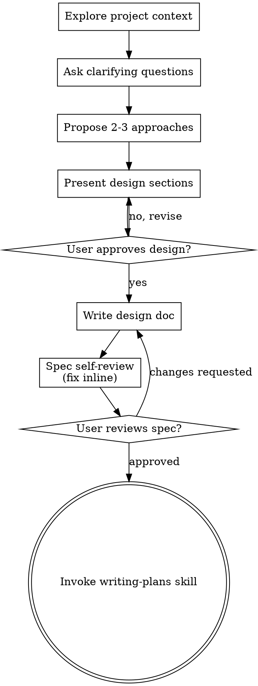

# 把想法头脑风暴成设计

通过自然的协作对话,帮用户把想法打磨成完整的设计与规格(spec)。

先理解当前项目上下文,然后**一次问一个问题**来细化想法。等你搞清楚要构建什么了,把设计呈现出来并获得用户批准。

<HARD-GATE>
在你**呈现了设计、且用户批准之前**,不要调用任何实现类技能、不要写任何代码、不要脚手架任何项目、不要采取任何实现动作。这适用于**每一个**项目,无论它看起来多简单。
</HARD-GATE>

## 反模式:「这太简单了,不需要设计」

每个项目都要走这个流程。一个 todo 列表、一个单函数工具、一次配置改动——全都要。「简单」项目恰恰是「未经审视的假设」造成最多返工的地方。设计可以很短(真正简单的项目几句话即可),但你**必须**呈现它并获得批准。

## 检查清单

你**必须**为下列每一项建一个任务,并按顺序完成:

1. **探索项目上下文** —— 查看文件、文档、近期提交
2. **适时提供可视化伴侣** —— 不要一上来就提。第一次遇到「用画的比用说的更清楚」的问题时,再单独发一条消息提议;用户同意后其浏览器标签页会打开。若始终没有可视化问题,就永远别提。见下方「可视化伴侣」小节。
3. **提澄清问题** —— 一次一个,理解目的/约束/成功标准
4. **提出 2-3 个方案** —— 带取舍 + 你的推荐
5. **呈现设计** —— 分节呈现,每节篇幅与其复杂度匹配,每节之后征得用户认可
6. **写设计文档** —— 存到 `docs/superpowers/specs/YYYY-MM-DD-<主题>-design.md` 并提交
7. **spec 自审** —— 就地快速检查占位符、矛盾、歧义、范围(见下)
8. **用户复审书面 spec** —— 请用户在继续前审阅 spec 文件
9. **转入实现** —— 调用 writing-plans 技能来创建实现计划

## 流程图

**终态是调用 writing-plans。** 不要调用 frontend-design、mcp-builder 或任何其它实现类技能。brainstorming 之后唯一要调用的技能就是 writing-plans。

## 具体流程

**理解想法:**

- 先看清当前项目状态(文件、文档、近期提交)
- 在问细节问题之前先评估范围:如果需求描述的是**多个相互独立的子系统**(例如「做个带聊天、文件存储、计费、分析的平台」),立即指出来。别在一个「需要先拆解」的项目上花问题去抠细节。
- 如果项目大到单份 spec 装不下,帮用户拆成子项目:哪些是独立部分、彼此关系、该按什么顺序构建?然后按正常设计流程 brainstorm 第一个子项目。每个子项目走自己的 spec → plan → 实现 循环。
- 对于范围合适的项目,一次问一个问题来细化想法
- 尽量用选择题,开放式问题也可以
- 每条消息只问一个问题——一个话题需要深挖就拆成多个问题
- 聚焦于理解:目的、约束、成功标准

**探索方案:**

- 提出 2-3 个不同方案,附带取舍
- 用对话方式呈现选项,给出你的推荐和理由
- 把推荐方案放第一位并解释为什么

**呈现设计:**

- 一旦你相信自己理解了要构建什么,就呈现设计
- 每节篇幅与复杂度匹配:直白的几句话,微妙的可到 200-300 字
- 每节之后问一下「到这儿看着对吗」
- 覆盖:架构、组件、数据流、错误处理、测试
- 如果哪里说不通,随时准备回头澄清

**为「隔离与清晰」而设计:**

- 把系统拆成更小的单元,每个只有一个清晰目的、通过定义良好的接口通信、能被独立理解和测试
- 对每个单元,你应该能回答:它做什么、怎么用、依赖什么?
- 别人能不读内部实现就理解一个单元做什么吗?你能改内部而不破坏使用方吗?不能的话,边界就需要再打磨。
- 更小、边界清晰的单元也更好协作——你对「能一次装进上下文」的代码推理得更好,文件聚焦时你的编辑更可靠。文件变大,往往是「它做得太多」的信号。

**在既有代码库里工作:**

- 提出改动前先探索现有结构。遵循既有模式。
- 既有代码若有影响本次工作的问题(如文件过大、边界不清、职责纠缠),把有针对性的改进作为设计的一部分——像一个好开发者会改进自己正在动的代码那样。
- 不要提无关的重构。聚焦当前目标。

## 设计之后

**文档:**

- 把验证过的设计(spec)写到 `docs/superpowers/specs/YYYY-MM-DD-<主题>-design.md`
  - (用户对 spec 位置的偏好覆盖此默认)
- 如有 elements-of-style:writing-clearly-and-concisely 技能就用上
- 把设计文档提交到 git

**Spec 自审:**
写完 spec 文档后,用新的眼光再看一遍:

1. **占位符扫描:** 有没有 "TBD"、"TODO"、未完成的章节、含糊的需求?修掉。
2. **内部一致性:** 各节之间有没有互相矛盾?架构和功能描述对得上吗?
3. **范围检查:** 这是否聚焦到能用单份实现计划覆盖,还是需要拆解?
4. **歧义检查:** 有没有需求能被两种解读?有的话,选一种并写明确。

就地修掉问题。不必再审——修完继续。

**用户复审关卡:**
自审循环通过后,请用户在继续前审阅书面 spec:

> 「spec 已写好并提交到 `<路径>`。请审阅,若想在开始写实现计划前改动请告诉我。」

等用户回复。若要改动,改完再跑一遍自审循环。只有用户批准了才继续。

**实现:**

- 调用 writing-plans 技能来创建详细的实现计划
- 不要调用任何其它技能。writing-plans 是下一步。

## 关键原则

- **一次一个问题** —— 别用多个问题淹没用户
- **优先选择题** —— 比开放式更好答
- **狠抓 YAGNI** —— 从所有设计里删掉不必要的功能
- **探索备选** —— 定案前总是提 2-3 个方案
- **增量验证** —— 呈现设计、获批准再往下
- **保持灵活** —— 哪里说不通就回头澄清

## 可视化伴侣

> ⚠️ **wraith 环境说明**:「可视化伴侣」是上游 superpowers 的一个浏览器 WebSocket 服务(见 `scripts/`),依赖其运行环境。**在 wraith 里不接入、不运行**——本节保留仅为方法论完整性;实际 brainstorm 时用文本/终端(或 wraith 自己的桌面 UI)即可。以下为上游原文所述行为。

一个基于浏览器的伴侣,在 brainstorm 时展示 mockup、图示与可视化选项。它是一个**工具**而非**模式**。接受它意味着「在需要可视化的问题上它可用」,并不意味着每个问题都走浏览器。

**适时提供(just-in-time):** 不要一上来就提。等到某个问题「画出来确实比说出来清楚」——是真正的 mockup / 布局 / 图示问题,而不仅仅是一个 UI *话题*——第一次遇到时再单独发一条消息提议:
> 「接下来这部分我给你画出来可能更清楚——我可以在浏览器标签里边聊边做 mockup、图示和对比。它还比较新、也比较费 token。要不要?要的话我给你打开。」

**这条提议必须是独立一条消息。** 只有提议——没有澄清问题、总结或其它内容。等用户回复。接受则用 `--open` 启动服务,让浏览器自动打开第一屏;拒绝则继续纯文本,不再提,除非用户自己提起。

**逐问决策:** 即使用户接受了,也要**为每个问题**决定走浏览器还是终端。判据:**用户看图比读字更容易理解吗?**

- **走浏览器**:内容本身是视觉的——mockup、线框、布局对比、架构图、并排视觉设计
- **走终端**:内容是文字——需求问题、概念选择、取舍列表、A/B/C/D 文字选项、范围决策

一个关于 UI 话题的问题不自动等于一个可视化问题。「在这个语境里 personality 指什么?」是概念问题——走终端。「哪种向导布局更好?」是可视化问题——走浏览器。

若用户同意用伴侣,继续前先读详细指南:`references/visual-companion.md`。

---
> 本技能改编自 obra/superpowers(MIT)的 `brainstorming`,方法论正文完整翻译;可视化伴侣的脚本与详解为上游原文保留、wraith 环境不运行。
