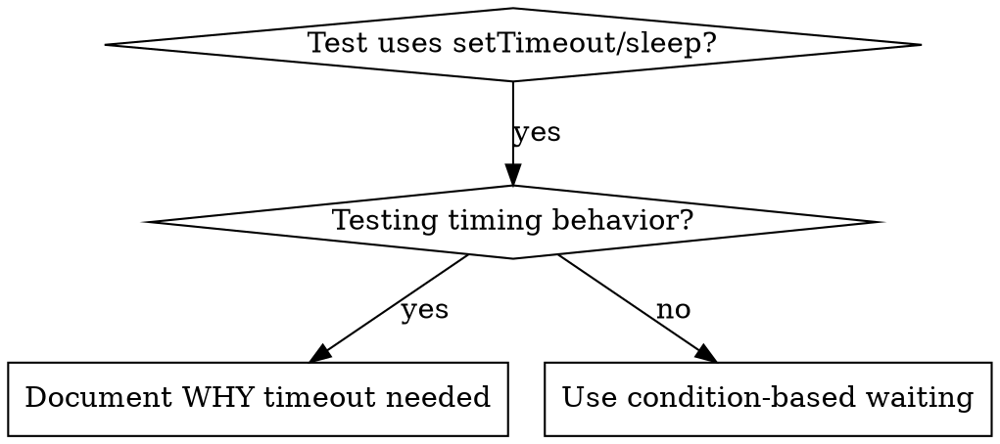

# 基于条件的等待(Condition-Based Waiting)

## 概述

不稳定(flaky)的测试常用「任意延时」去猜时序。这制造竞态:快机器上过,负载下或 CI 里挂。

**核心原则:等你真正关心的那个条件,而不是猜它要多久。**

## 何时用



**用当:**
- 测试有任意延时(`setTimeout`、`sleep`、`time.sleep()`)
- 测试 flaky(时过时挂、负载下挂)
- 并行跑时测试超时
- 等异步操作完成

**别用当:**
- 测的就是时序行为(debounce、throttle 间隔)
- 用任意超时时永远写明【为什么】

## 核心范式

```typescript
// ❌ 之前:猜时序
await new Promise(r => setTimeout(r, 50));
const result = getResult();
expect(result).toBeDefined();

// ✅ 之后:等条件
await waitFor(() => getResult() !== undefined);
const result = getResult();
expect(result).toBeDefined();
```

## 快速范式

| 场景 | 范式 |
|------|------|
| 等事件 | `waitFor(() => events.find(e => e.type === 'DONE'))` |
| 等状态 | `waitFor(() => machine.state === 'ready')` |
| 等数量 | `waitFor(() => items.length >= 5)` |
| 等文件 | `waitFor(() => fs.existsSync(path))` |
| 复合条件 | `waitFor(() => obj.ready && obj.value > 10)` |

## 实现

通用轮询函数:
```typescript
async function waitFor<T>(
  condition: () => T | undefined | null | false,
  description: string,
  timeoutMs = 5000
): Promise<T> {
  const startTime = Date.now();

  while (true) {
    const result = condition();
    if (result) return result;

    if (Date.now() - startTime > timeoutMs) {
      throw new Error(`Timeout waiting for ${description} after ${timeoutMs}ms`);
    }

    await new Promise(r => setTimeout(r, 10)); // 每 10ms 轮询
  }
}
```

本目录 `condition-based-waiting-example.ts` 有完整实现,含来自真实调试的领域专用 helper(`waitForEvent`、`waitForEventCount`、`waitForEventMatch`)。

## 常见错误

**❌ 轮询太快:** `setTimeout(check, 1)` —— 浪费 CPU
**✅ 修:** 每 10ms 轮询

**❌ 无超时:** 条件永不满足就死循环
**✅ 修:** 永远带超时 + 清晰错误

**❌ 陈旧数据:** 循环前缓存了状态
**✅ 修:** 在循环内调 getter 取新鲜数据

## 什么时候「任意超时」是对的

```typescript
// 工具每 100ms tick 一次 —— 需 2 个 tick 来验证部分输出
await waitForEvent(manager, 'TOOL_STARTED'); // 先:等条件
await new Promise(r => setTimeout(r, 200));   // 再:等定时行为
// 200ms = 100ms 间隔的 2 个 tick —— 有文档、有理由
```

**要求:**
1. 先等触发条件
2. 基于已知时序(不是猜)
3. 注释解释【为什么】

## 现实影响

来自一次调试(2025-10-03):
- 修了 3 个文件里 15 个 flaky 测试
- 通过率:60% → 100%
- 执行时间:快 40%
- 不再有竞态

---
> 本文件完整翻译自 obra/superpowers(MIT)`systematic-debugging` 的 condition-based-waiting;代码保留原样,配套完整实现见同目录 `condition-based-waiting-example.ts`。
