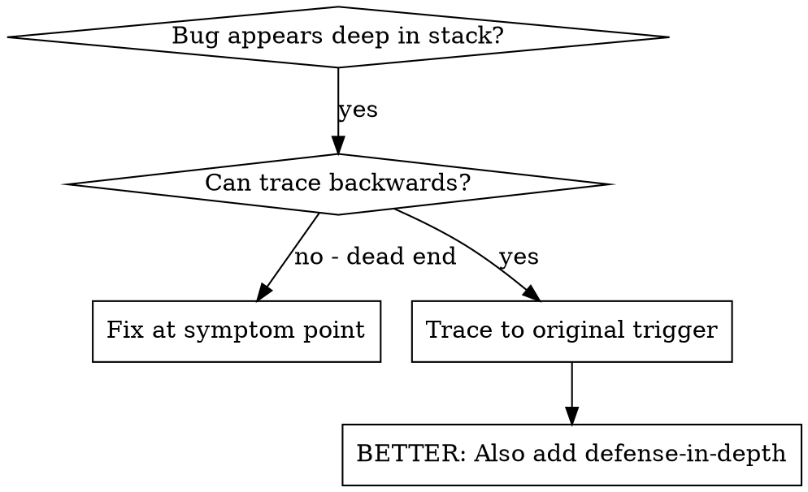
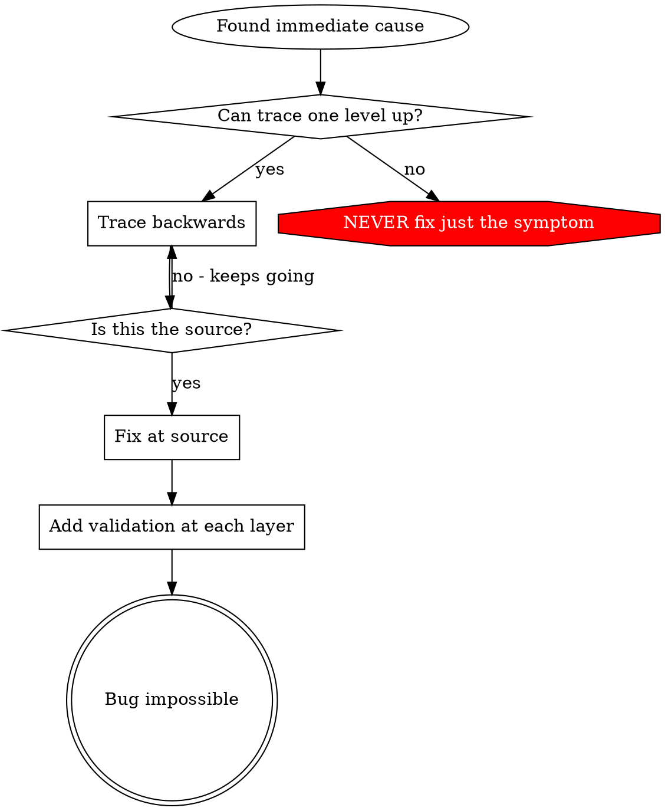

# 根因追溯(Root Cause Tracing)

## 概述

bug 常在调用栈深处显形(git init 在错的目录、文件建在错的位置、数据库用错路径打开)。你的本能是「在报错处修」,但那是治标。

**核心原则:沿调用链反向追溯,直到找到最初的触发点,然后在源头修。**

## 何时用



**在以下情况用:**
- 错误发生在执行深处(不在入口)
- 栈追踪显示很长的调用链
- 不清楚非法数据从哪来
- 需要找出哪个测试/代码触发了问题

## 追溯流程

### 1. 观察症状
```
Error: git init failed in ~/project/packages/core
```

### 2. 找直接原因
**哪段代码直接导致这个?**
```typescript
await execFileAsync('git', ['init'], { cwd: projectDir });
```

### 3. 问:谁调了这里?
```typescript
WorktreeManager.createSessionWorktree(projectDir, sessionId)
  → called by Session.initializeWorkspace()
  → called by Session.create()
  → called by test at Project.create()
```

### 4. 一直往上追
**传了什么值?**
- `projectDir = ''`(空串!)
- 空串作 `cwd` 会解析成 `process.cwd()`
- 那就是源码目录!

### 5. 找到最初触发点
**空串从哪来?**
```typescript
const context = setupCoreTest(); // 返回 { tempDir: '' }
Project.create('name', context.tempDir); // 在 beforeEach 之前就访问了!
```

## 加栈追踪

手动追不动时,加埋点:

```typescript
// 在有问题的操作之前
async function gitInit(directory: string) {
  const stack = new Error().stack;
  console.error('DEBUG git init:', {
    directory,
    cwd: process.cwd(),
    nodeEnv: process.env.NODE_ENV,
    stack,
  });

  await execFileAsync('git', ['init'], { cwd: directory });
}
```

**关键:** 测试里用 `console.error()`(不用 logger——可能不显示)

**跑并捕获:**
```bash
npm test 2>&1 | grep 'DEBUG git init'
```

**分析栈追踪:**
- 找测试文件名
- 找触发调用的行号
- 识别模式(同一个测试?同一个参数?)

## 找出哪个测试造成污染

若某东西在测试期间出现、但你不知道是哪个测试:

用本目录的二分脚本 `find-polluter.sh`:
```bash
./find-polluter.sh '.git' 'src/**/*.test.ts'
```
逐个跑测试,在第一个「污染者」处停。用法见脚本。

## 真实例子:空 projectDir

**症状:** `.git` 建在 `packages/core/`(源码)

**追溯链:**
1. `git init` 在 `process.cwd()` 跑 ← 空 cwd 参数
2. WorktreeManager 被空 projectDir 调用
3. Session.create() 传了空串
4. 测试在 beforeEach 前访问了 `context.tempDir`
5. setupCoreTest() 初始返回 `{ tempDir: '' }`

**根因:** 顶层变量初始化访问了空值
**修复:** 把 tempDir 改成 getter,若在 beforeEach 前访问就抛错

**还加了纵深防御:**
- 第 1 层:Project.create() 校验目录
- 第 2 层:WorkspaceManager 校验非空
- 第 3 层:NODE_ENV 守卫,拒绝在 tmpdir 外 git init
- 第 4 层:git init 前记录栈追踪

## 关键原则



**永远不要只在报错处修。** 反向追到最初触发点。

## 栈追踪小贴士

- **测试里:** 用 `console.error()` 不用 logger——logger 可能被抑制
- **操作前:** 在危险操作之前记录,而非失败之后
- **带上下文:** 目录、cwd、环境变量、时间戳
- **抓栈:** `new Error().stack` 显示完整调用链

## 现实影响

来自一次调试(2025-10-03):
- 5 层追溯找到根因
- 在源头修(getter 校验)
- 加了 4 层防御
- 1847 个测试通过,零污染

---
> 本文件完整翻译自 obra/superpowers(MIT)`systematic-debugging` 的 root-cause-tracing;代码/图示保留原样。
