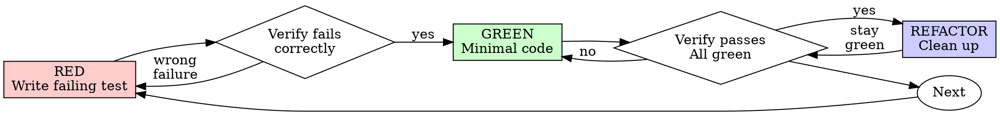

# 测试驱动开发(TDD)

## 概述

先写测试。看它失败。写最少代码让它通过。

**核心原则:如果你没看着测试失败,你就不知道它测的是不是对的东西。**

**违反规则的字面,就是违反规则的精神。**

## 何时用

**总是:**
- 新功能
- 修 bug
- 重构
- 行为变更

**例外(问你的搭档):**
- 一次性原型
- 生成的代码
- 配置文件

在想「就这一次跳过 TDD」?停。那是合理化。

## 铁律

```
没有先失败的测试,就没有生产代码
```

在测试之前写了代码?删掉。重来。

**无例外:**
- 别留着当「参考」
- 别一边写测试一边「改造」它
- 别看它
- 删就是删

从测试重新实现。就这样。

## 红-绿-重构



### RED —— 写会失败的测试

写一个最小测试,表明「应该发生什么」。

<Good>
```typescript
test('retries failed operations 3 times', async () => {
  let attempts = 0;
  const operation = () => {
    attempts++;
    if (attempts < 3) throw new Error('fail');
    return 'success';
  };

  const result = await retryOperation(operation);

  expect(result).toBe('success');
  expect(attempts).toBe(3);
});
```
名字清晰,测真实行为,只测一件事
</Good>

<Bad>
```typescript
test('retry works', async () => {
  const mock = jest.fn()
    .mockRejectedValueOnce(new Error())
    .mockRejectedValueOnce(new Error())
    .mockResolvedValueOnce('success');
  await retryOperation(mock);
  expect(mock).toHaveBeenCalledTimes(3);
});
```
名字含糊,测的是 mock 不是代码
</Bad>

**要求:**
- 一个行为
- 名字清晰
- 真实代码(除非不可避免,否则不用 mock)

### 验证 RED —— 看它失败

**强制。永不跳过。**

```bash
npm test path/to/test.test.ts
```

确认:
- 测试失败(不是报错)
- 失败信息符合预期
- 因「功能缺失」而失败(不是因拼写错)

**测试通过了?** 你在测已有行为。修测试。
**测试报错了?** 修错,重跑,直到它正确地失败。

### GREEN —— 最少代码

写最简单的代码让测试通过。

<Good>
```typescript
async function retryOperation<T>(fn: () => Promise<T>): Promise<T> {
  for (let i = 0; i < 3; i++) {
    try {
      return await fn();
    } catch (e) {
      if (i === 2) throw e;
    }
  }
  throw new Error('unreachable');
}
```
刚好够通过
</Good>

<Bad>
```typescript
async function retryOperation<T>(
  fn: () => Promise<T>,
  options?: {
    maxRetries?: number;
    backoff?: 'linear' | 'exponential';
    onRetry?: (attempt: number) => void;
  }
): Promise<T> {
  // YAGNI
}
```
过度设计
</Bad>

别加功能、别重构别的代码、别在测试之外「改进」。

### 验证 GREEN —— 看它通过

**强制。**

```bash
npm test path/to/test.test.ts
```

确认:
- 测试通过
- 其它测试仍通过
- 输出干净(无错误、无警告)

**测试失败?** 修代码,不是修测试。
**其它测试挂了?** 现在就修。

### REFACTOR —— 清理

仅在绿之后:
- 去重复
- 改名字
- 抽 helper

保持测试绿。别加行为。

### 重复

为下一个功能写下一个会失败的测试。

## 好测试

| 品质 | 好 | 坏 |
|------|----|----|
| **最小** | 一件事。名字里有 "and"?拆开。 | `test('validates email and domain and whitespace')` |
| **清晰** | 名字描述行为 | `test('test1')` |
| **体现意图** | 展示期望的 API | 掩盖代码该做什么 |

## 为什么顺序重要

**「我事后写测试来验证它能跑」**

事后写的测试立刻就过。立刻通过什么都证明不了:可能测错东西、可能测实现而非行为、可能漏了你忘的边界、你从没见它抓到 bug。测试先行逼你看它失败,证明它真在测东西。

**「我已经手动测过所有边界了」**

手动测试是临时的。你以为都测了,但:没有测了什么的记录、代码变了不能重跑、压力下容易忘、"我试的时候是好的" ≠ 全面。自动测试是系统的,每次都同样地跑。

**「删掉 X 小时的工作太浪费」**

沉没成本谬误。时间已经没了。你现在的选择:删掉用 TDD 重写(再花 X 小时,高信心),或留着事后补测试(30 分钟,低信心,大概率有 bug)。真正的「浪费」是留着你不敢信的代码。没有真实测试的可运行代码就是技术债。

**「TDD 很教条,务实就要变通」**

TDD 就是务实:提交前抓 bug(比事后调试快)、防回归、记录行为、支持重构。「务实」的捷径 = 生产环境调试 = 更慢。

**「事后测试达到同样目标——重精神不重仪式」**

不。事后测试回答「这做什么?」测试先行回答「这该做什么?」事后测试被你的实现带偏——你测你造的,不是被要求的;你验证记得的边界,不是发现的边界。测试先行逼你在实现前发现边界。30 分钟事后测试 ≠ TDD:你拿到覆盖率,失去「测试有效」的证明。

## 常见合理化

| 借口 | 真相 |
|------|------|
| "太简单不用测" | 简单代码也会坏。测试 30 秒。 |
| "我事后测" | 立刻通过什么都证明不了。 |
| "事后测达到同样目标" | 事后=「这做什么」,先行=「这该做什么」。 |
| "已经手动测过" | 临时 ≠ 系统。没记录、不能重跑。 |
| "删 X 小时太浪费" | 沉没成本。留未验证代码是技术债。 |
| "留作参考、先写测试" | 你会去改造它。那就是事后测。删就是删。 |
| "得先探索" | 行。丢掉探索,用 TDD 重来。 |
| "难测=设计不清" | 听测试的。难测=难用。 |
| "TDD 拖慢我" | TDD 比调试快。务实=测试先行。 |
| "手动测更快" | 手动证明不了边界。每次改都要重测。 |
| "既有代码没测试" | 你在改进它。给既有代码补测试。 |

## 危险信号——停,重来

- 先代码后测试
- 实现后才测
- 测试立刻就过
- 说不出测试为何失败
- 测试「稍后」补
- 合理化「就这一次」
- "我已经手动测了"
- "事后测达到同样目的"
- "重精神不重仪式"
- "留作参考"或"改造既有代码"
- "已花 X 小时,删了浪费"
- "TDD 教条,我务实"
- "这个不一样,因为……"

**这些全都意味着:删代码,用 TDD 重来。**

## 例:修 bug

**Bug:** 空邮箱被接受

**RED**
```typescript
test('rejects empty email', async () => {
  const result = await submitForm({ email: '' });
  expect(result.error).toBe('Email required');
});
```

**验证 RED**
```bash
$ npm test
FAIL: expected 'Email required', got undefined
```

**GREEN**
```typescript
function submitForm(data: FormData) {
  if (!data.email?.trim()) {
    return { error: 'Email required' };
  }
  // ...
}
```

**验证 GREEN**
```bash
$ npm test
PASS
```

**REFACTOR**
如需要,为多个字段抽取校验。

## 验证清单

标记工作完成之前:

- [ ] 每个新函数/方法都有测试
- [ ] 实现前看着每个测试失败
- [ ] 每个测试因预期原因失败(功能缺失,非拼写错)
- [ ] 为每个测试写最少代码使其通过
- [ ] 所有测试通过
- [ ] 输出干净(无错误、警告)
- [ ] 测试用真实代码(除非不可避免才 mock)
- [ ] 边界与错误已覆盖

不能全打勾?你跳过了 TDD。重来。

## 卡住时

| 问题 | 解法 |
|------|------|
| 不知道怎么测 | 写你希望的 API。先写断言。问搭档。 |
| 测试太复杂 | 设计太复杂。简化接口。 |
| 必须 mock 一切 | 代码耦合太重。用依赖注入。 |
| 测试 setup 巨大 | 抽 helper。还复杂?简化设计。 |

## 与调试结合

发现 bug?写一个复现它的失败测试。走 TDD 循环。测试既证明修复、又防回归。永远别在没有测试的情况下修 bug。

## 测试反模式

加 mock 或测试工具时,读 [testing-anti-patterns.md](references/testing-anti-patterns.md) 避免常见坑:
- 测 mock 行为而非真实行为
- 给生产类加只给测试用的方法
- 不理解依赖就 mock

## wraith 说明

- 桌面(TS)用 vitest:`npx vitest run <名>`;后端(Java)JUnit,测试默认跳过需 `-DskipTests=false`。
- **测试隔离铁律**:测试绝不写真实 `~/.wraith/config.json` / 索引 / 审计 / memory;只测纯逻辑或用临时路径。

## 最终规则

```
生产代码 → 存在一个「先失败过」的测试
否则 → 不是 TDD
```

没有搭档许可,无例外。

---
> 本技能完整翻译自 obra/superpowers(MIT)`test-driven-development`;代码示例保留原样,末节为 wraith 说明。
